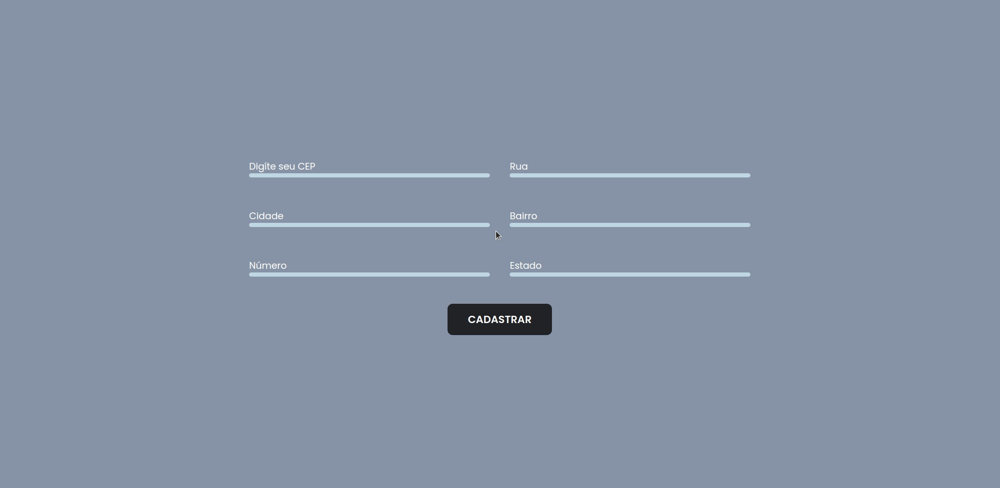

<h1>Formulário com CEP automatico</h1>

O projeto está no ar nesse link: <a href="https://brunoferreiraa123.github.io/form-cep/"> Formulário</a>

<h2>:grey_exclamation: Sobre</h2>

Formulário que utiliza a API ViaCep para exibir as informações do cep digitado pelo usuário :smiley:

<h2>:hammer: Ferramentas</h2>

Esse projeto utiliza a API ViaCep: <a href="https://viacep.com.br/">ViaCep</a>

Projeto construído com <a href="http://vanilla-js.com/">VanillaJS.</a>

<h2></h2>
Desenvolvido por por Bruno | <a href="https://www.linkedin.com/in/brunoo-ferreiraa/">Linkedin</a>
